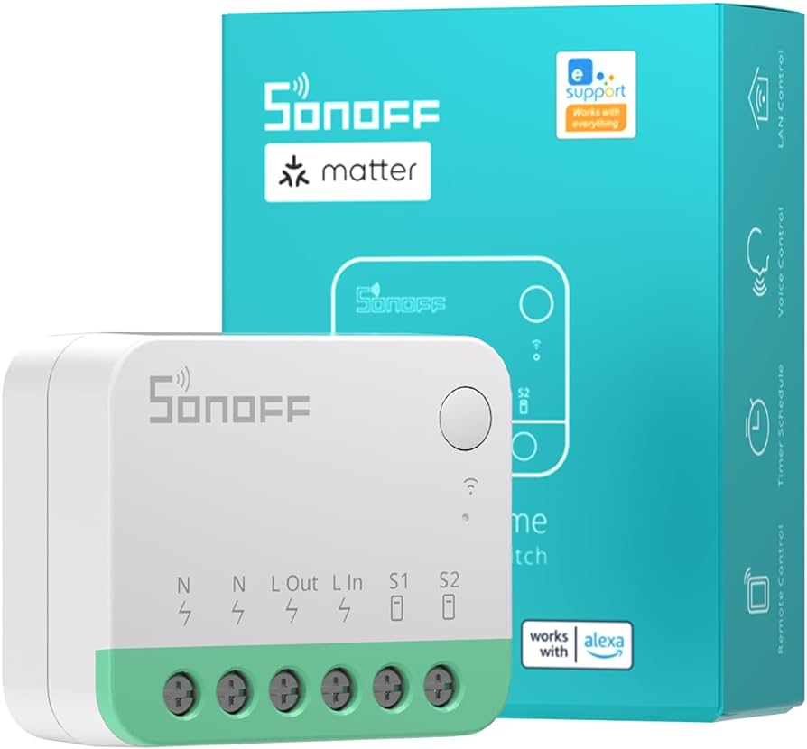
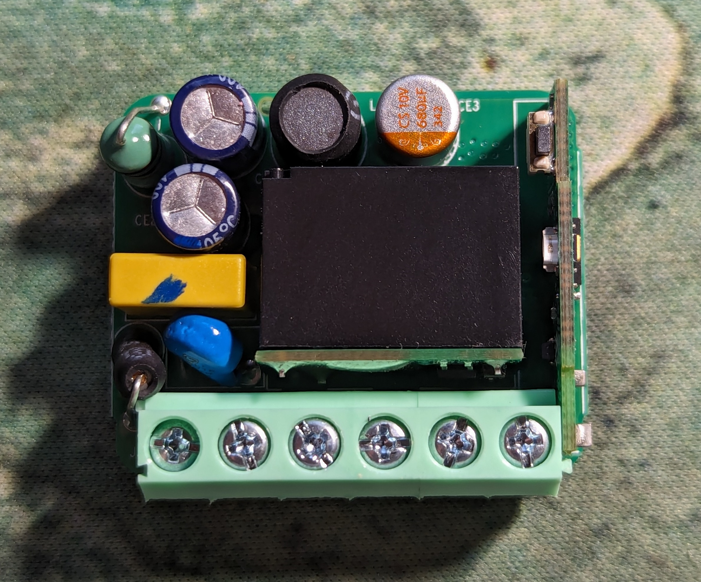
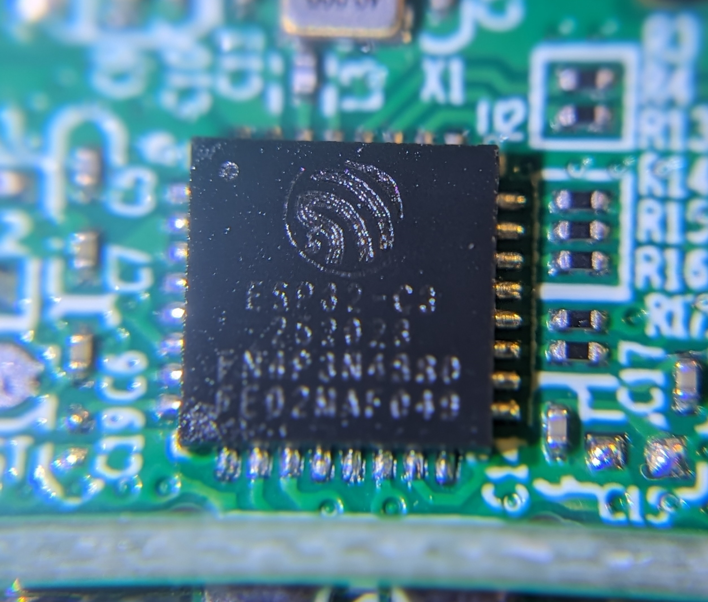

SONOFF'S First Matter Device, with one (detachable) relay, one external input, one button. Switch is really small, approx 40x33mm, easily fits behind wall switch.

Product page: [https://sonoff.tech/product/diy-smart-switches/minir4m/](https://sonoff.tech/product/diy-smart-switches/minir4m/)

## Features

Chip used: ESP32-C3
RISC-V 32-bit 160Mhz Microprocessor
4MB Flash
Flash locked

## Programming

Rx, Tx, Gnd and 3V3 pads are available, but due to Matter certification - ESP32-C3 flash is locked and no reflash is possible.

A new ESP32-C3 IC is required to programm the unit with ESPHome flash.

I bought an ESP32-C3 SuperMini module (with USB-C) and was able to flash it either with esptool or directly via ESPHome.

NOTE: Make sure to get the model with integrated 4MB flash.

After successfully flashing the new IC, simply replace the original IC with a custom one.





## GPIO Pinout

| Pin    | Function                   |
|--------|----------------------------|
| GPIO04 | Relay output               |
| GPIO05 | S2 (external switch input) |
| GPIO09 | BUTTON                     |
| GPIO19 | Blue LED                   |
| GPIO20 | RX                         |
| GPIO21 | TX                         |

## Basic Config with external rocker switch

```yaml
substitutions:
  device_name: minir4m

esphome:
  name: ${device_name}
  comment: "Sonoff MiniR4M"

esp32:
  board: esp32-c3-devkitm-1
  framework:
    type: arduino

# Enable logging
logger:

# Enable Home Assistant API
api:

# Allow Over-The-Air updates
ota:

# Allow provisioning Wi-Fi via serial
improv_serial:

wifi:
  networks:
    - ssid: !secret wifi_ssid
      password: !secret wifi_password
  ap: {}

# In combination with the `ap` this allows the user
# to provision wifi credentials to the device via WiFi AP.
captive_portal:

dashboard_import:
  package_import_url: github://esphome/firmware/esphome-web/esp32c3.yaml@v2
  import_full_config: true

# Sets up Bluetooth LE (Only on ESP32) to allow the user
# to provision wifi credentials to the device.
esp32_improv:
  authorizer: none

# To have a "next url" for improv serial
web_server:

output:
  # Physical relay on GPIO
  - platform: gpio
    pin: GPIO04
    id: relay_1

  # Status LED output
  - platform: gpio
    pin: GPIO19
    id: status_led_output
    inverted: true


light:
  - platform: binary
    id: light_1
    name: ${friendly_name}
    icon: mdi:ceiling-light-multiple-outline
    restore_mode: restore_default_off
    output: relay_1
    on_turn_on:
      - output.turn_on: status_led_output
    on_turn_off:
      - output.turn_off: status_led_output

binary_sensor:
  - platform: gpio
    pin: GPIO09
    id: button
    filters:
      - invert:
      - delayed_off: 50ms
    on_press:
      - light.toggle:
          id: light_1
  - platform: gpio
    name: s1
    pin: GPIO05
    id: s1
    filters:
      - invert:
      - delayed_off: 50ms
    on_state:
      then:
        - light.toggle:
            id: light_1
```
